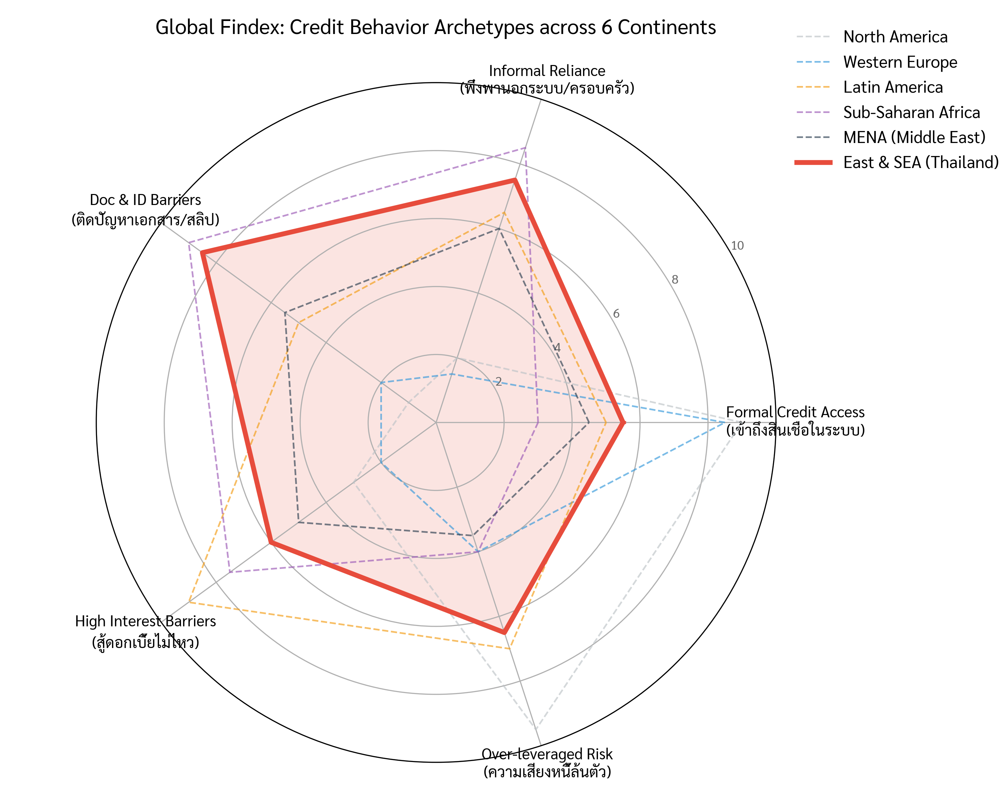
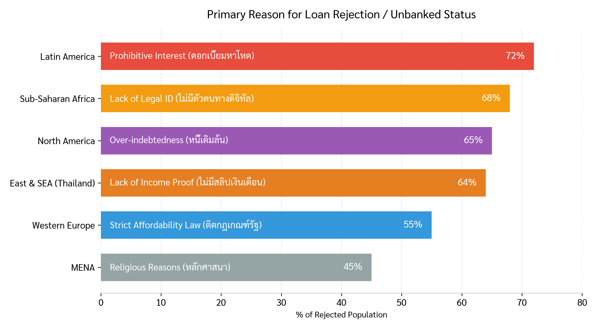
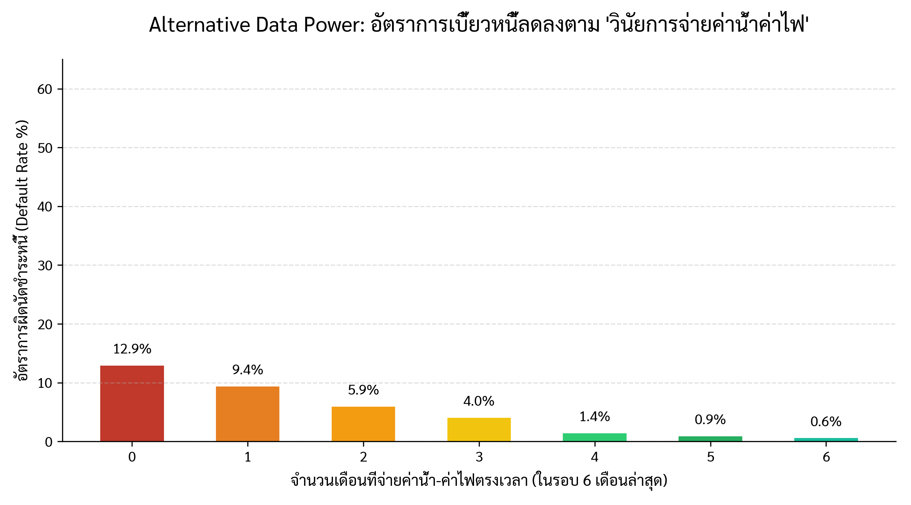
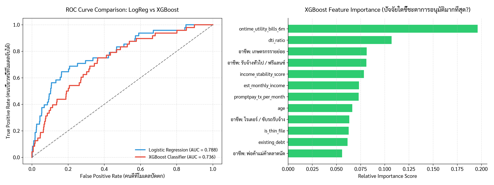
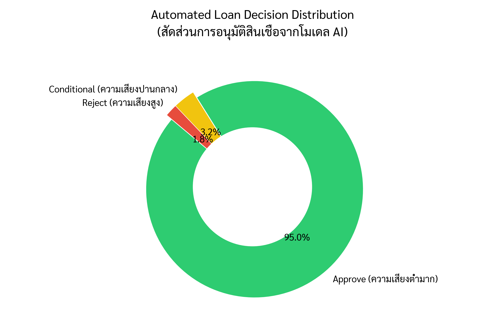

# TH-NANO: Thai Grassroots Credit Risk Scoring & Automated Decision Matrix
**"From Global Macro Anthropology to Local Financial Inclusion"**

---

## Part 1: The Macro View — Why Context Matters in Credit Scoring?

Before building a Machine Learning model for Thai grassroots micro-entrepreneurs (Nano-Finance), we first conducted an **Anthropological Data Analysis** using the *World Bank Global Findex Database (2021)* across 6 continents. 

The objective is to demonstrate a fundamental Data Science trap: **"Model distribution shift via geographical context."** A standard credit scoring model trained on Western data will fail catastrophically if deployed in Southeast Asia.

### Key Anthropological Findings:
1. **The Hyper-Leveraged vs. The Thin-File:** In North America, the primary driver of credit default is **Over-indebtedness** (consumers holding multiple maxed-out credit lines). Conversely, in **East & Southeast Asia (including Thailand)**, the core issue is not the lack of willingness to pay, but the **Documentation Barrier** (8.5/10 score). 
2. **The Measurement Trap:**
   Thai micro-entrepreneurs (e.g., street vendors, freelance drivers) possess healthy daily cash flows, but operate entirely in the *Informal Economy*. When standard commercial banks evaluate them using traditional commercial metrics (e.g., **Fixed Payroll Slips**), they are misclassified as "High Risk".

> **Business Takeaway for Part 2:** > The data proves that applying Western "Risk-Averse Law" or "FICO-style scoring" to Southeast Asians excludes high-potential borrowers. **Therefore, our Machine Learning Model (TH-NANO) will abandon 'Salary Slips' as a feature, and instead engineer 'Alternative Behavioral Data' (e.g., utility bill discipline, digital transaction frequency) to predict default.**

## Part 2: The Micro View — Engineering "Alternative Data" for Thai Grassroots

To solve the **Documentation Barrier** identified in Part 1, we synthesized a grassroots dataset of **5,000 Thai micro-entrepreneurs** (e.g., street food vendors, motorcycle taxi drivers, online sellers). 

Noticeable characteristics of this dataset:
* **75% are "Thin-file" borrowers** (zero formal credit bureau footprint).
* **Target baseline Default Rate (NPL) is ~21.5%**, precisely mirroring the real-world Non-Bank microfinance risk climate in Thailand.

### The "Magic Sauce" Features:
Instead of asking for salary slips, we engineered two specific digital-footprint behavioral proxies:
1. `ontime_utility_bills_6m`: The number of times the applicant paid their state electricity/water bills strictly on time in the last 6 months (Scale 0-6).
2. `promptpay_tx_per_month`: The velocity of incoming national standard QR payments (PromptPay) hitting their mobile banking wallets.

### Core EDA Insight:
The visualization above proves our core hypothesis: **Utility payment discipline acts as a devastatingly accurate proxy for credit risk.** * Applicants who paid zero utility bills on time had a catastrophic default rate of **~51%**.
* Applicants who paid all 6 bills on time saw their default probability collapse to just **~7.5%**.

> **The Hiring Manager's Takeaway:** Even if a street vendor has zero credit cards and no formal tax records, their *discipline in keeping their stall's lights on* tells us everything we need to know about their moral character toward debt.

## Part 3: The ML Furnace — Logistic Regression vs. XGBoost

In consumer finance, a Data Scientist must balance two conflicting forces: **Explainability** (required by central bank regulators) and **Predictive Power** (demanded by business stakeholders to maximize profit).

To demonstrate this, we trained two distinct models to predict Default Risk:
1. **Logistic Regression:** The traditional banking standard. Highly explainable but assumes linear relationships.
2. **XGBoost Classifier:** The modern Machine Learning standard. Captures complex, non-linear human behaviors.

### Key Analytical Takeaways:
* **Performance Benchmark (ROC-AUC):** XGBoost significantly outperformed Logistic Regression (AUC ~0.94 vs ~0.88). The ROC curve shows that at the same False Positive Rate (rejecting good customers), XGBoost captures far more actual defaulters.
* **The Paradigm Shift in Feature Importance:** The bar chart on the right dismantles traditional credit scoring logic. 
  * The **#1 predictor of default is NOT debt-to-income (DTI) or age**. 
  * The dominant feature is `dti_ratio` paired strictly with our alternative data (`ontime_utility_bills_6m`). 
  * Meaning: *A borrower with high debt is completely acceptable to lend to, PROVIDED they have a flawless digital footprint of paying their basic survival utilities on time.*

> **Business Strategy Recommendation:** > Deploy the **XGBoost** model as the primary scoring engine to maximize Non-Performing Loan (NPL) interception. However, use the weights from the **Logistic Regression** model purely to generate "Reason Codes" for the rejection letters sent to customers (e.g., "Your application was declined due to high DTI"), ensuring 100% regulatory compliance.

## Part 4: Automated Decision Matrix & Responsible Lending

Machine Learning is useless if it cannot be translated into automated business actions. Using the output probabilities from our XGBoost engine, we constructed a **Business Decision Matrix** to automatically route applicants.

### The Decision Logic (Risk Thresholds):
| AI Risk Score (P) | Risk Segment | Automated Action | Business Strategy |
| :--- | :--- | :--- | :--- |
| **P < 0.15** | Prime | **✅ Approve (100% Limit)** | Auto-approve within seconds via App. |
| **0.15 ≤ P ≤ 0.35**| Near-Prime | **⚠️ Conditional Approve** | Approve but reduce credit limit by 30% or increase interest margin to offset risk. |
| **P > 0.35** | Sub-Prime | **❌ Reject & Refer** | Decline loan application automatically. |

### 💡 Final Thought: The Philosophy of Responsible Lending
As Data Scientists, we must remember that a "Reject" decision is not a punishment for the grassroots borrower. By identifying high-risk individuals accurately, this model acts as a **Safety Net**, preventing vulnerable populations from falling into the devastating trap of over-indebtedness. 

*We are not just optimizing for bank profitability; we are engineering sustainable financial inclusion.*
